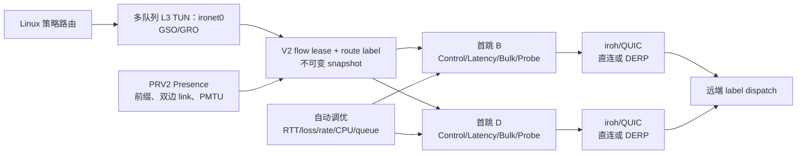

# Ironet

`ironet` 是运行在 Linux 上的三层加密覆盖网络。它使用 iroh/QUIC 建立经认证的节点邻接关系，在多队列 GSO/GRO TUN 接口与 QUIC DATAGRAM 之间传递 PacketTrain/Cell，并按实时路径状态自动调节 Bulk、FEC、Repair、pacing 和接收预算。

当前软件版本为 `0.1.0`，唯一网络协议为 **Ironet Protocol V2**。正式 `ironetd` 直接运行 V2 数据面，不包含 V1 协商、解码或回退入口。协议分层与不变量见 [Protocol V2](docs/protocol-v2.md)。配置、Presence 和 wire format 在首次稳定发布前允许不兼容演进。

## 项目范围

- 每个守护进程创建并管理一个三层 TUN 接口，默认名称为 `ironet0`；接口内部按 CPU 数使用最多 8 条队列。
- 节点使用签名 Presence 传播节点地址、前缀归属和转发能力；固定 peer 用于引导连接。
- 同一流持有 V2 route-label lease；拓扑变化时原子发布不可变 generation，旧 generation 最多保留两个以自然排空在途 PacketTrain。
- 每条邻接由单写者发送，Bulk 使用有界 DRR，Latency 使用 EDF，并在最多 4 个 Cell 后重新检查抢占。
- PacketTrain 保留 GSO 语义，Cell 是 QUIC DATAGRAM 的独立调度/FEC 单元；丢失数据优先由低冗余 FEC 恢复，再通过可靠 Repair 补齐。
- 固定 bootstrap peer 交换经过 owner 签名和 network membership tag 验证的 V2 Presence；transit peer 是覆盖层路径，不与 DERP underlay 混为一层。
- 默认仅允许直连 UDP、DERP 和已连接节点的覆盖层中转；V2 不启用 iroh relay。
- 守护进程以 `CAP_NET_ADMIN` 运行；操作命令通过 Unix 控制套接字访问守护进程。

当前约束：仅支持 Linux；每个节点按单一互联网出口建模；每条流在一个租约内只使用一条覆盖路径；未实现多路径发送。

## 架构



Topology compiler 根据双边认证的 link、健康度和 cost 生成端到端 route label。transit 热路径只校验 expected-ingress、epoch 和 hop shim，然后按 label 查找下一邻接，不扫描 Presence、前缀或策略，也不解码 Record/FEC。

## 安装与首次运行

运行节点需要 Linux、`/dev/net/tun`、`iproute2`、`iptables` 和 `CAP_NET_ADMIN`。
安装 Debian 包或从源码安装：

```bash
sudo dpkg -i ./ironet_0.1.0_amd64.deb
# 或
nix develop -c cargo build --locked --release
sudo scripts/install.sh
```

第一台机器创建网络。节点名和 Overlay IPv4/IPv6 地址默认自动生成；命令会生成身份、原子写入并密封配置，然后启动服务：

```bash
sudo ironet network create production
```

创建一个一小时有效的邀请：

```bash
sudo ironet invite create --expires 1h
```

在另一台机器粘贴输出的 `ironet://join/v2/...` 地址：

```bash
sudo ironet join 'ironet://join/v2/...'
```

声明式部署可改用密码直连：authority 创建网络时配置 `--password-file`，
加入端只声明 authority 的 `IP:PORT` 和同一份密码文件：

```bash
sudo ironet network create production --password-file /run/secrets/ironet-password
sudo ironet join --peer 203.0.113.10:4000 --password-file /run/secrets/ironet-password
```

密码直连在同一数值端口使用 TCP 完成加密的临时邀请签发，数据面继续使用 UDP；
详细流程见[快速开始](docs/快速开始.md#密码直连加入适合-nixos-等声明式部署)。

需要向网络发布本地 LAN 时再启用该能力：

```bash
sudo ironet subnet publish 192.168.50.0/24
```

需要让本机承担 overlay 中转时执行：

```bash
sudo ironet transit enable
```

无需手工复制 network ID 或 endpoint ID，也无需编辑或密封 TOML。无人值守部署可用 `--output json`、`--invite-file` 和 `--no-start`。完整流程见 [快速开始](docs/快速开始.md)。

## 日常操作

```bash
sudo ironet health
sudo ironet status
sudo ironet metrics
sudo ironet peers
sudo ironet tui
sudo ironet ping 21.0.0.3
sudo ironet trace 21.0.0.3
sudo ironet route add 192.168.30.0/24 --owner branch-c
sudo ironet route import ./site-routes.txt
sudo ironet route list
sudo ironet route remove 192.168.30.0/24
sudo ironet reload
```

静态远端路由由 CLI 原子写入 `identity_file` 同目录的 `routes.toml`（默认
`/var/lib/ironet/routes.toml`），不会混入或重写 `config.toml`。导入和删除
在守护进程运行时会自动 reload；`--dry-run` 可预览，维护窗口可加 `--defer`
延后应用。

`status`、`peers`、`ping` 与 `trace` 支持 `--output human|json|jsonl`（`status` 也保留 `--json`）。`metrics` 从同一份实时 V2 snapshot 输出 `ironet_v2_*` Prometheus 文本指标。Human 输出会按量级展示时间、字节数和速率（例如 `1m30s`、`1.5MB/s`、`1.5Mbit/s`）；JSON/JSONL 始终保留原始基础单位，适合脚本处理。0.1 的 Peer status JSON 将计数归入 `traffic`，策略归入 `policy.live` 与可空的 `policy.shadow`，例如 `.peers[0].traffic.tx_bytes` 与 `.peers[0].policy.live.policy_id`。`tui` 是交互式运维台，`Tab` 可切换 Peer、Routes、Diagnostics 三个视图：查看实时链路，在 Routes 中按 `a` 接受或按两次 `x` 移除持久路由，在 Diagnostics 中直接对所选节点执行 ping/trace；任意视图按两次 `R` 可校验并 reload 守护进程。原 `top` 命令保留为兼容别名。

服务、监控、配置更新、备份与排障命令见 [运行与运维](docs/运行与运维.md)。

## 文档

- [文档索引](docs/README.md)
- [快速开始：两节点静态拓扑](docs/快速开始.md)
- [配置参考](docs/配置参考.md)
- [运行与运维](docs/运行与运维.md)
- [开发与测试](docs/开发与测试.md)
- [架构与路由模型](docs/架构与路由模型.md)
- [扩展开发：控制 API、事件与期望状态](docs/扩展开发.md)
- [实施计划](PLAN.md)

## 开发

```bash
nix develop -c cargo fmt --check
nix develop -c cargo test --locked
nix develop -c cargo clippy --locked --all-targets -- -D warnings
nix build
```

网络集成测试需要 Docker、`/dev/net/tun` 和特权网络命名空间：

```bash
tests/netns/run-all.sh
```

详细的测试矩阵、打包和发布步骤见 [开发与测试](docs/开发与测试.md)。提交规范见 [CONTRIBUTING.md](CONTRIBUTING.md)。

## 目录结构

```text
.
├── src/          Rust 代码；CLI、守护进程、转发与传输实现
├── config/       可直接复制后修改的配置示例
├── systemd/      systemd unit、sysusers 与 sysctl 配置
├── nixos/        NixOS 模块
├── scripts/      安装、卸载、Debian 打包与发布脚本
├── tests/        单元测试、网络命名空间集成测试和真实网络测试
├── docs/         面向使用者和维护者的文档
├── .forgejo/     Forgejo CI 与发布工作流
└── .github/      GitHub CI、双架构 Debian 打包与发布工作流
```

## 许可

本项目同时采用 [MIT](LICENSE-MIT) 和 [Apache-2.0](LICENSE-APACHE) 许可。使用者可任选其一。
